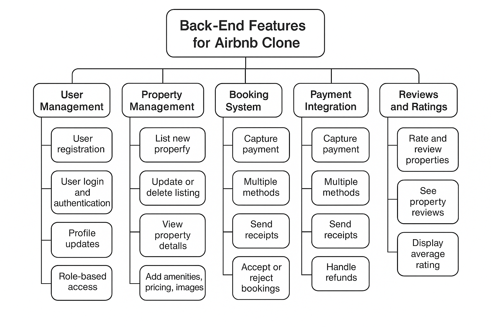

# 🧩 Airbnb Clone – Features and Functionalities

This document outlines the **core backend features** and functionalities required for the Airbnb Clone project. The goal is to ensure that the system supports all necessary operations, aligns with user needs, and provides a foundation for scalable development.

---

## ✅ Core Features

### 1. User Management
- User registration
- User login and authentication
- Profile updates
- Role-based access (guest/host)

### 2. Property Management
- Host can list a new property
- Host can update or delete a listing
- View property details
- Add property amenities, pricing, and images

### 3. Booking System
- Users can search and filter properties
- View availability and request bookings
- Confirm or cancel bookings
- Hosts can accept/reject bookings

### 4. Payment Integration
- Capture payment during booking
- Support multiple methods (M-Pesa, card, etc.)
- Send payment receipts
- Handle refunds

### 5. Reviews and Ratings
- Guests can rate and leave reviews after a stay
- Hosts can see reviews of their properties
- Display average property rating

---

## 🛠 Tool Used

This feature map was created using **Draw.io** and exported as a visual overview.

---

## 🖼 Features Diagram

