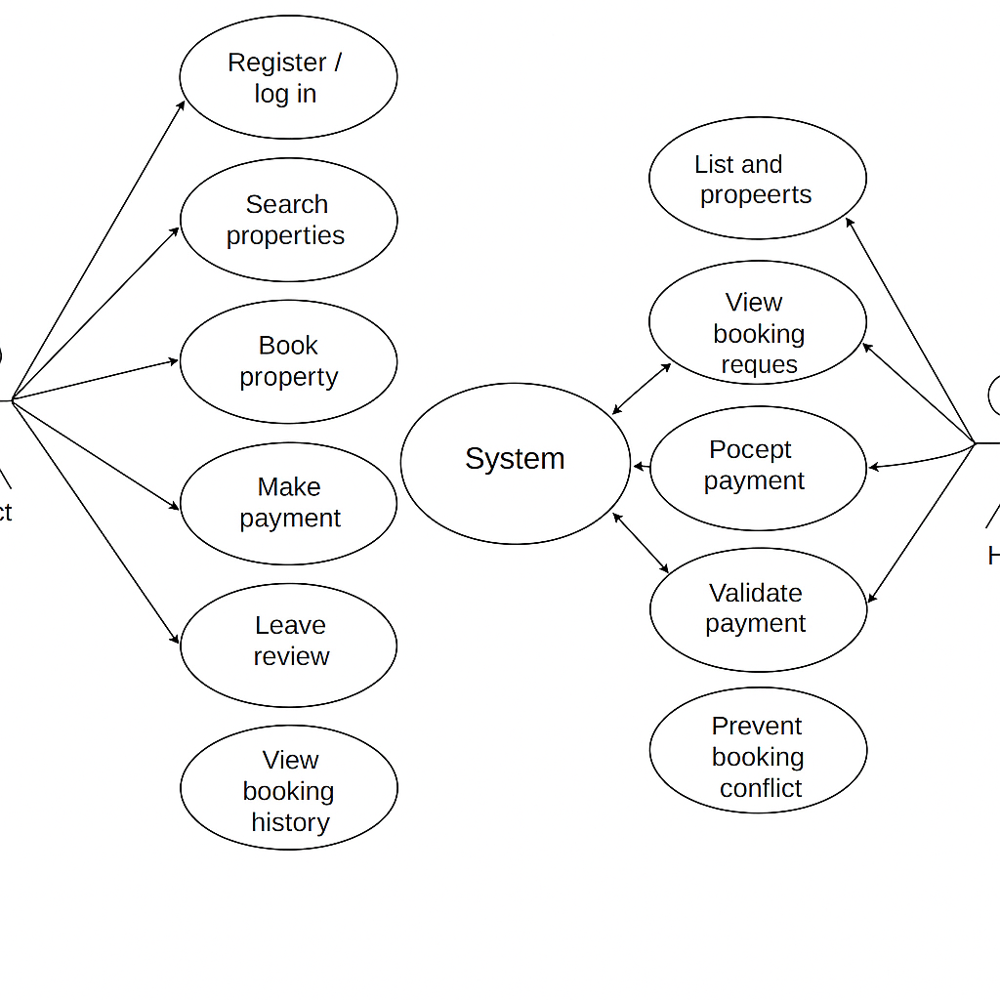

# 🎭 Use Case Diagram – Airbnb Clone

This section contains the **Use Case Diagram** for the backend functionalities of the Airbnb Clone project.

The diagram illustrates how different users interact with the system to perform key operations such as:

- User registration and login
- Property listing and management
- Property search and booking
- Payment processing
- Reviews and booking history

---

## 👤 Actors Involved

- **Guest**: A user looking to book a property.
- **Host**: A user listing properties for booking.
- **System**: The backend that processes, validates, and manages interactions.

---

## 📌 Purpose of the Diagram

- Visually represent all major use cases and interactions.
- Clarify system scope before development.
- Guide user story creation, feature planning, and API design.

---

## 🖼️ Use Case Diagram

---

> This diagram was created using Draw.io based on feature documentation and is part of the ALX Airbnb backend planning process.
